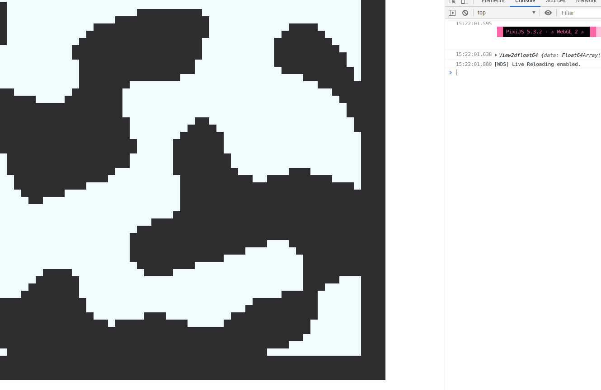

# Cavearium


2d game with procedural generation based on opensimplex noise. Written on typescript with render on pixi.js and physics on planck.js(box2d js port).
It meant to be a pet project for learning Typescript & some gamedev patterns.

> Development state:  [early-early-early demo]


### Procedural generation
Game uses a combination of warley and opensimplex noises. Opensimplex noise is mapped to
warley cells.

### Engine
Game uses my own custom engine with implementation of ECS pattern.
Each entity is a combination of separate components and can be defined 
dynamically. ~~well, it's damn js, everything can be defined dynamically but it's different~~

### World structure
World is separated to chunks. Currently chunk is 64 by 64 tiles. When chunk goes into view
it's entities being added to physics simulation(actually their Body components).

### Some of my optimization tricks
Every block actually doesn't have it's own static body in the physics simulation. Instead I'm using optimization technic by composing tilemap matrix into the fewest number of rectangles and then adding them as a static bodies to Box2D world. I have a separate [repo](https://github.com/unkindypie/matrix-decomposition)
 for testing it. 

Maybe it isn't the best idea how to put
this kind of game into browser but it was the best I came up with at that time.

### How to run it

```
npm install
npm run dev
```
then open http://localhost:8080


